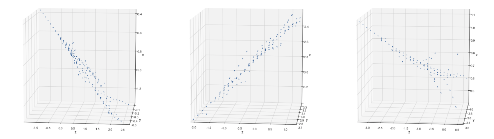

## Reconstruction of 3D Shower Structures for Neutrino Experiments

#### Authors: [V. Belavin] (vbelavin@hse.ru), [E. Trofimova] (etrofimova@hse.ru), [A. Ustyuzhanin] (austyuzhanin@hse.ru)

### Overview

This directory contains code necessary to run the Electromagnetic Showers (EM) Reconstruction algorithm that is devided into the following parts:
1) Graph Construction;
2) Edge Classification;
3) Showers Clusterization;
4) Parameters Reconstruction.

#### Experimental Data

X, Y, Z coordinates and the direction of the EM Showers base-tracks. 

The showers are generated using FairShip framework. 

#### Results

The algorithm detects ~ 65% of Showers and assess the coordinates and direction of base-tracks with ~ 75% accuracy.

Clusters Examples:

### Running the code

